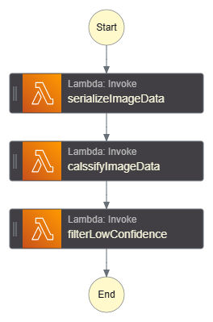
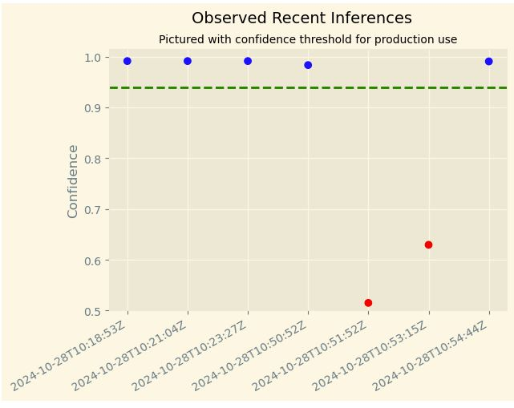
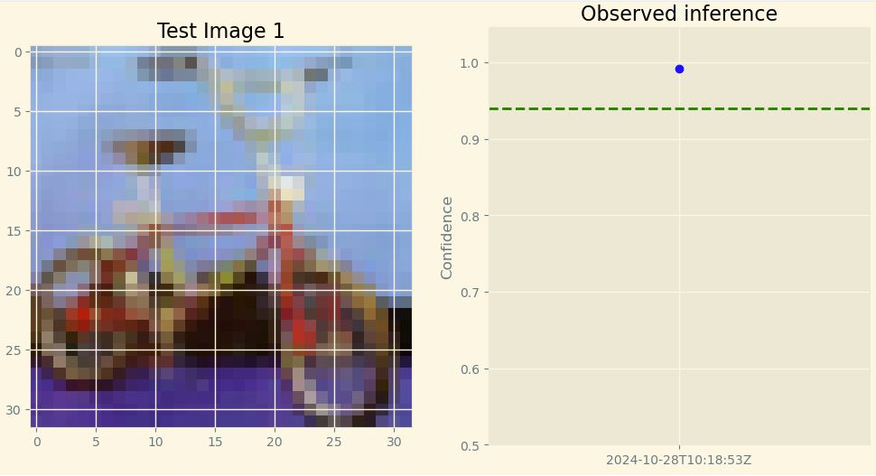

# Build a machine learning workflow in AWS

## Introduction to AWS Machine Learning project

## Overview
This project is part of the AWS Machine Learning Engineer Udacity Nanodegree program. The objective of the project is to design, deploy and monitor the machine learning workflow.

### Dependencies

```
Python 3.8
Pandas >= 1.2.4
ml.t3.medium instance
Python 3.8 runtime for the AWS Lambda Functions
```

### Installation
For this project, it is highly recommended to use Sagemaker Studio from the course provided AWS workspace. This will simplify much of the installation needed to get started.
Additional tools needed are AWS Lambda and AWS Step Function available also in AWS workspace.


## Project files

1. [`ml_workflow_setup_and_deploy.ipynb`](./ml_workflow_setup_and_deploy.ipynb) Jupyter Notebook containing the machine learning model for image classification setup and deployment 
2. [`ml_workflow_setup_and_deploy.html`](./ml_workflow_setup_and_deploy.html) html file covering the above
3. [`lambda.py`](./lambda.py) File containing all 3 AWS Lambda functions (serializeImageData, classifyImageData, filterLowConfidence) used in the below Step Function
4. [`ProjectStepFunction.asl.json`](./ProjectStepFunction.asl.json) ML workflow created based on three AWS Lambda functions
5. [`stepfunctions_graph.png`](./stepfunctions_graph.png) Step Function visualization

## Step Function Graph


## Step Function Graph


## Observed inferences examples




